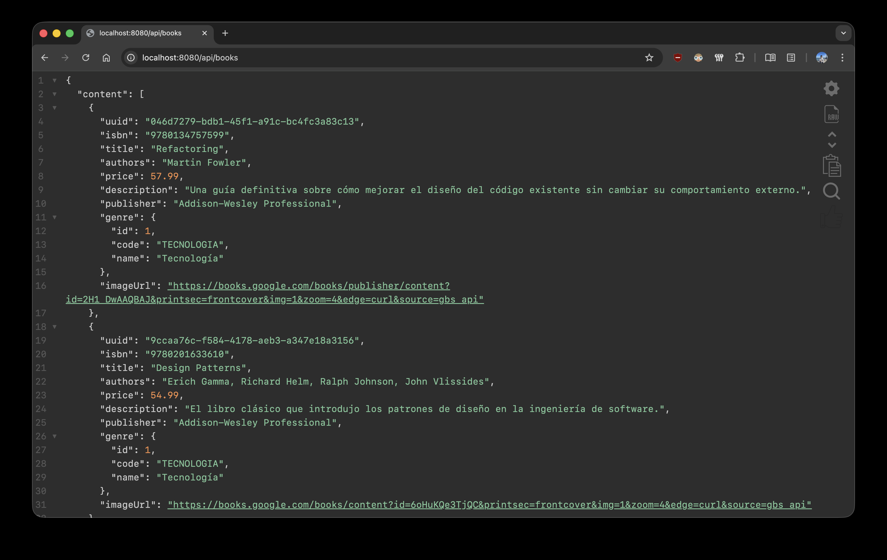

## MercadoLibros REST API

Este repositorio contiene una API REST hecha con Spring Boot que provee un CRUD de libros.



### Programa necesario para ejecutar la aplicación:

- Docker Desktop

### Para ejecutarla localmente

1. Clonar el repositorio

```bash
git clone git@github.com:agusbattista/mercadolibros-springboot.git
```

2. Entrar a la carpeta generada

```bash
cd mercadolibros-springboot
```

3. Levantar la aplicación completa

> [!IMPORTANT]
> Docker Desktop debe estar corriendo antes de ejecutar el siguiente comando

```bash
docker compose up -d
```

 Este comando hará lo siguiente:
 - Compilará el código Java con Maven
 - Construirá la imagen de Docker para la aplicación
 - Levantará todos los servicios (app + MySQL + phpMyAdmin)

> [!NOTE]
> La primera vez que se ejecute, el proceso puede tardar unos minutos ya que debe descargar las dependencias necesarias.
> Una vez que se hayan descargado, las siguientes ejecuciones serán mucho más rápidas.

### Corroborar que funciona

La API estará disponible en:
<http://localhost:8080/api/books>

El panel phpMyAdmin estará disponible en:
<http://localhost:8081>

> [!NOTE]
> phpMyAdmin se conecta automáticamente con las credenciales configuradas en Docker Compose (por defecto: usuario `root`, contraseña `root`).

### Personalización de credenciales (opcional)

El proyecto viene configurado con credenciales por defecto para desarrollo local.

Para configurar tus propias credenciales podes renombrar el archivo env.example a .env de la siguiente manera:

```bash
mv env.example .env
```

Luego, editar las variables a gusto.

> [!NOTE] 
> Si no se configuran estas variables, se utilizarán los valores por defecto definidos en **docker-compose.yml** y **application.properties**.

### Ejecución híbrida (desarrollo avanzado)

Si preferís ejecutar la aplicación con el JDK de Java 21 instalado en tu máquina y usar Docker sólo para la base de datos, podés hacer lo siguiente:

1. Asegurarte de tener Java 21 instalado y configurado en tu sistema (sugiero temurin21).
2. Levantar únicamente MySQL y/o phpMyAdmin (el panel phpMyAdmin es opcional, se puede utilizar DBeaver, MySQL Workbench o cualquier otro cliente de base de datos):

```bash
docker compose up -d mysql phpmyadmin
```

3. Ejecutar la aplicación con Maven:

```bash
./mvnw spring-boot:run
```

> [!NOTE]
> Con este enfoque, la aplicación se conectará automáticamente a MySQL corriendo en Docker.
> 
> Es útil para desarrollar ya que los cambios en el código se ven reflejados automáticamente al compilar y volver a ejecutar sin necesidad de reconstruir la imagen Docker.

### Endpoints disponibles

- `GET /api/books` - Listar todos los libros
- `GET /api/books/{uuid}` - Obtener un libro por su UUID
- `GET /api/books/isbn/{isbn}` - Obtener un libro por ISBN
- `GET /api/books/search` - Buscar libros por criterios (título, autores, género, editorial)
  - **Parámetros opcionales (query params):**
    - `title` - Buscar por título (búsqueda parcial, no es sensible a mayúsculas y minúsculas)
    - `authors` - Buscar por autores (búsqueda parcial, no es sensible a mayúsculas y minúsculas)
    - `genre` - Buscar por género (búsqueda exacta, no es sensible a mayúsculas y minúsculas)
    - `publisher` - Buscar por editorial (búsqueda parcial, no es sensible a mayúsculas y minúsculas)
  - **Ejemplos:**
    - `/api/books/search?title=Design%20Patterns` - Libros cuyo título contenga "design patterns"
    - `/api/books/search?genre=FANTASÍA&authors=Patrick` - Libros de "patrick" del género "fantasía"
    - `/api/books/search` - Sin parámetros devuelve todos los libros
- `POST /api/books` - Crear un libro
- `PUT /api/books/{uuid}` - Actualizar un libro
- `DELETE /api/books/{uuid}` - Eliminar un libro (borrado lógico / soft delete)

> [!NOTE] 
> La API utiliza UUID como identificador para las operaciones de modificación y búsqueda específica.
>
> Al crear un libro, el sistema le asigna un UUID (que se incluye en la respuesta) para futuras consultas o modificaciones.
>
> Si intenta crear un libro con un ISBN que existe pero fue eliminado lógicamente, el sistema lo restaurará y actualizará sus datos.

### Paginación y ordenamiento

Todos los endpoints que devuelven listas de libros (`GET /api/books` y `GET /api/books/search`) soportan paginación y ordenamiento mediante query params.

#### Parámetros de paginación

- `page` - Número de página (comenzando desde 0). Por defecto: 0
- `size` - Cantidad de elementos por página. Por defecto: 5

#### Parámetros de ordenamiento

- `sort` - Campo y dirección de ordenamiento en formato `campo,direccion`. Por defecto: sin ordenación
  - Dirección puede ser `asc` (ascendente) o `desc` (descendente)
  - Se pueden aplicar múltiples ordenamientos agregando múltiples parámetros `sort`
  - Se puede utilizar cualquiera de los campos de un libro para el ordenamiento. Por defecto es ascendente

#### Ejemplos de uso

#### Paginación básica:

- `/api/books?page=0&size=2` - Primera página con 2 elementos
- `/api/books?page=1&size=5` - Segunda página con 5 elementos

#### Ordenamiento simple:

- `/api/books?sort=title,asc` - Ordenar por título ascendente
- `/api/books?sort=price,desc` - Ordenar por precio descendente

#### Ordenamiento múltiple:

- `/api/books?sort=genre,asc&sort=price,desc` - Ordenar por género ascendente, luego por precio descendente

#### Combinando paginación y ordenamiento:

- `/api/books?page=0&size=3&sort=price,asc` - Primera página con 3 elementos, ordenados por precio ascendente
- `/api/books/search?genre=Fantasía&page=0&size=2&sort=price,desc` - Búsqueda de género "Fantasía", primera página con 2 elementos, ordenados por precio descendente

#### Utilización de UUIDs

Se implementaron identificadores únicos universales (UUID) para exponer los recursos. Principalmente por dos motivaciones:
1. **Seguridad:** evita que los IDs autoincrementales de la base de datos sean públicos, previniendo la enumeración secuencial de recursos por parte de terceros.
2. **Aprendizaje:** fue de utilidad como ejercicio de implementación técnica en Spring Boot.

### Formato de un libro (ejemplo)

```JSON
{
  "uuid": "15226072-bbe0-402c-8691-2da79692be1b",
  "isbn": "9788466357562",
  "title": "1984",
  "authors": "George Orwell",
  "price": 8.99,
  "description": "La novela distópica más famosa sobre el totalitarismo y la vigilancia masiva.",
  "publisher": "Debolsillo",
  "genre": "Ficción",
  "imageUrl": "https://books.google.com/books/publisher/content?id=H8Y1EQAAQBAJ&printsec=frontcover&img=1&zoom=4&edge=curl&source=gbs_api"
}
```

### Datos de prueba

El proyecto contiene un **CommandLineRunner** que carga diez libros con datos de prueba. Esto ocurre la primera vez que se ejecuta la aplicación o que se corren los test.

Si la base de datos ya contiene elementos (aunque estén eliminados lógicamente), no se agregarán libros.

> [!WARNING]
> Evite editar o borrar el archivo "src/main/resources/data/books.json" si no está seguro de cómo hacerlo o qué clases debe ajustar.
>
> Si desea evitar que se carguen datos de prueba, elimine los siguientes archivos para no generar ningún conflicto:

```text
src/main/java/io/github/agusbattista/mercadolibros_springboot/config/BookDataLoader.java
```

```text
src/test/java/io/github/agusbattista/mercadolibros_springboot/config/BookDataLoaderTest.java
```

```text
src/main/resources/data/books.json
```
### Sobre la base de datos

En **application.properties** se utiliza la propiedad `spring.jpa.hibernate.ddl-auto=update`, lo que significa que Hibernate actualizará el esquema de la base de datos automáticamente según las entidades definidas en el código. Esto es útil para desarrollo, ya que permite que los cambios en las entidades se reflejen sin necesidad de ejecutar scripts SQL manualmente. 

Para producción, se recomienda utilizar `validate` o `none` y gestionar las migraciones de la base de datos para tener un control más preciso sobre los cambios en el esquema.

```code
spring.jpa.hibernate.ddl-auto=update
```

### Test

El proyecto contiene tests para las distintas capas de la aplicación. Se pueden ejecutar con el siguiente comando:

```bash
./mvnw test
```

### Colección Postman

El archivo **"mercadolibros-springboot.postman_collection.json"** provee una colección para Postman que puede ser importada y utilizada. La ventaja de este enfoque es que ya tiene los endpoints disponibles y ejemplos de que se espera para cada uno.

### Comandos útiles

```bash
# Detener Docker Compose manteniendo los datos
docker compose down

# Detener Docker Compose y eliminar volúmenes (limpieza completa de los datos)
docker compose down -v

# Reconstruir la aplicación luego de modificar el código
docker compose up -d --build

# Ver logs de la aplicación en tu terminal
docker compose logs -f app

# Cerrar los logs
# Ctrl + C en la terminal en la que se están mostrando
```

### Sobre el proyecto

> [!IMPORTANT]
> - Está en su primera versión.
> - Está **completamente dockerizado:** sólo necesitás Docker Desktop para ejecutarlo, sin configuraciones manuales de Java o bases de datos.
> - Se pretende comenzar por lo más básico para luego poder iterar sobre ello, construyendo nuevas funcionalidades y mejorando las existentes. 
> - Se demuestra lo aprendido a través de los avances del proyecto.
